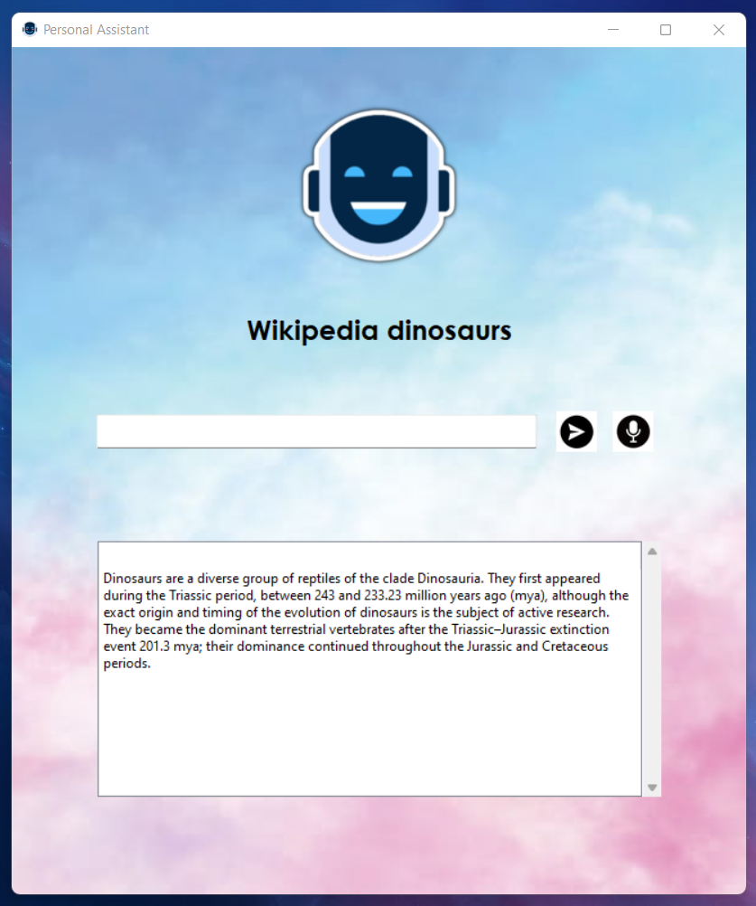

A voice recognition based GUI personal assistant, made with Python & Tkinter, that can be used to reply to simple commands.
And also to execute simple tasks.

MicroAI can help you get the latest news report, get articles straight from wikipedia, manage a To-Do list and so much more.

Clone this repository and head to the \`Steps to Follow section\` to get started.

## 🌟 Features

- Get input from both keyboard and microphone
- Get articles from Wikipedia
- Answer simple questions
- Take Screenshots
- Search on Google
- Open Websites
- Get the latest news
- Get Weather Report
- Manage and Maintain a MySQL To-Do list
- *more features on the way...*

## 📱 Screenshots
- Help Section

    

- Command Specific Help

     

- Successful Code Execution

     

- Compile Time Error Output

     

- Run-Time Error Output

     

## ❓How to Use

### Pre-requisites
- **Python & PIP** are installed and added to `PATH`

- **MySQL Server & Command Line Client** are installed and the server is active

### Steps to Follow

- Create an Application, & get the **`APP ID`** from your [WolframAlpha Developer Account](https://developer.wolframalpha.com/portal/myapps/index.html)

- Create a `.env` file in the project root directory with the obtained APP ID
    ```
    APP_ID=<your wolframalpha application id>
    ```
- Get the dependencies, in your terminal, execute -
    ```
    pip -r requirements/requirements.txt
    ```
- Make sure the local MySQL server is running, then in your **MySQL Command Line Client**, login and execute -
    ```
    mysql> source <path-to-cloned-repo>\requirements\required-queries.sql;
    ```

- That's it, now you can run it -
    ```
    python UI.py
    ```


## 🤝 Contributing

Contributions are always welcome!

See the [Contribution Guide](contributing.md) for ways to get started.

## 📖Lessons Learned

**`MicroAI`** was a really important project for me. I presented this project as a part of my high-school graduation skill. Although the event asked for something way less intuitive than something like this, I put in a lot of effort to make this the best one ever made in my school.

I learnt many things along the way, the most notable ones are mentioned below -

- Tkinter
- Python-MySQL interfacing
- WolframAlpha Client
- TTS
- Many other python libraries
- **and so much more...**

## 💡 Authors

- [@Anikate De](https://www.github.com/Anikate-De)

## 📝 License

Copyright © 2022-present, Anikate De

This project is licensed under [Apache License 2.0](LICENSE)